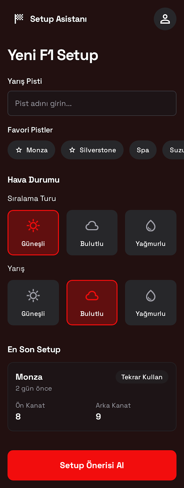
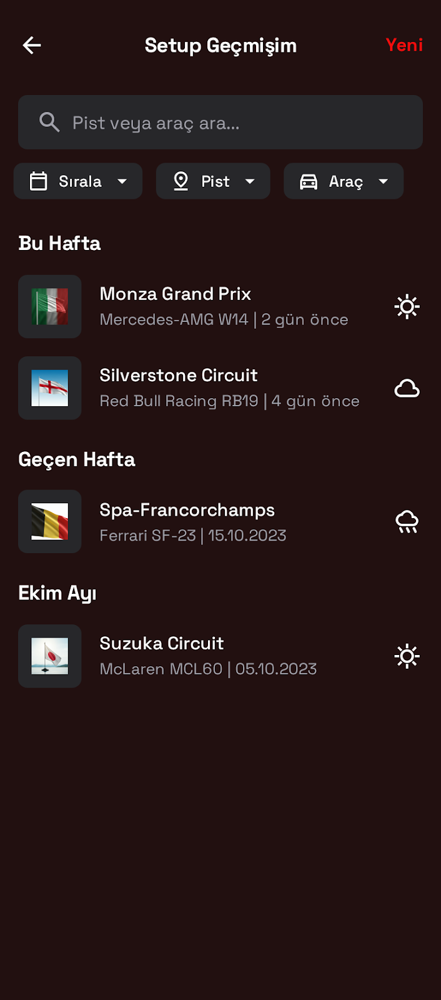
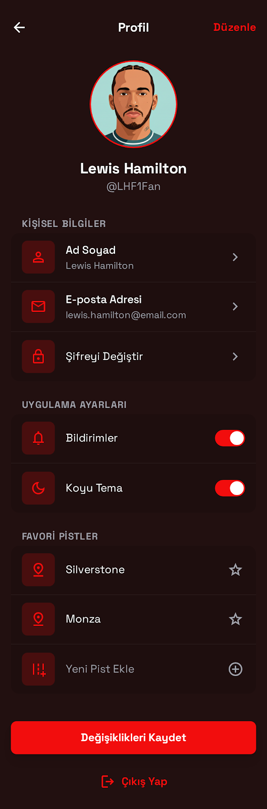
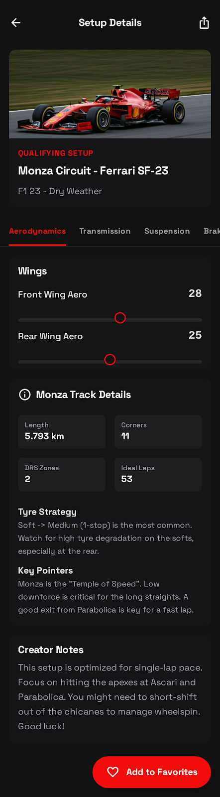
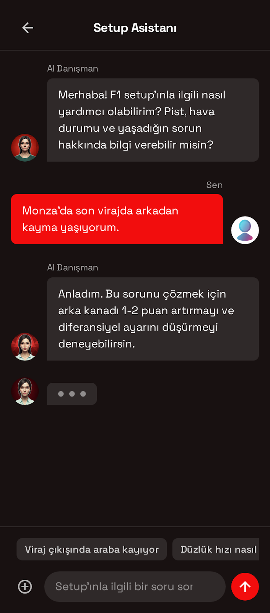

<div align="center">

# 🏎️ F1 Setup Instructor

### AI-Powered Formula 1 Car Setup Assistant

[](https://kotlinlang.org)
[](https://developer.android.com/jetpack/compose)
[](https://www.android.com)
[](LICENSE)

<p align="center">
  
  
  
  
</p>

*Your intelligent companion for optimizing F1 car setups across different tracks, weather conditions, and racing styles.*

[Features](#-features) • [Tech Stack](#-tech-stack) • [Architecture](#-architecture) • [Getting Started](#-getting-started) • [Screenshots](#-screenshots)

---

</div>

## 🎯 About

**F1 Setup Instructor** is an advanced Android application designed to help F1 game enthusiasts and sim racers find the perfect car setup for any track and weather condition. Powered by AI, the app provides personalized setup recommendations, maintains a history of your setups, and offers an interactive chatbot for real-time assistance.

### Why F1 Setup Instructor?

- 🤖 **AI-Powered Recommendations**: Get intelligent setup suggestions based on track characteristics, weather, and your racing style
- 📊 **Detailed Setup Parameters**: Comprehensive aerodynamics, suspension, transmission, and tire pressure settings
- 🌦️ **Weather Adaptation**: Tailored setups for dry, wet, and mixed conditions
- 💬 **Interactive Chatbot**: Ask questions and get instant answers about your setup
- 📜 **Setup History**: Keep track of all your previous configurations
- 🎨 **Modern UI/UX**: Beautiful, intuitive interface with Material Design 3

## ✨ Features

### 🏁 Core Features

- **Smart Setup Generator**
  - Select track, session type, and weather conditions
  - AI analyzes and provides optimal setup recommendations
  - Detailed breakdown of all car parameters

- **Setup Details**
  - Aerodynamics (front/rear wing)
  - Transmission (differential settings)
  - Suspension Geometry (camber, toe)
  - Suspension (springs, anti-roll bars, ride height)
  - Brakes (pressure, bias)
  - Tires (pressure for all four wheels)
  - Track-specific strategies and tips

- **Setup History**
  - Browse all your previous setups
  - Search and filter by track or car
  - Sort by date or alphabetically
  - Quick access to past configurations

- **AI Chatbot**
  - Ask setup-related questions
  - Get real-time advice and explanations
  - Understand the reasoning behind setup choices

- **User Profile**
  - Manage personal information
  - Favorite tracks
  - Customizable preferences
  - Dark mode support

## 🛠 Tech Stack

### Android & Kotlin
- **Language**: Kotlin 2.0.21
- **Min SDK**: 24
- **Target SDK**: 34
- **Compile SDK**: 35

### UI Framework
- **Jetpack Compose**: Modern declarative UI toolkit
- **Material Design 3**: Latest Material Design components
- **Coil**: Image loading library
- **Compose Navigation**: Type-safe navigation

### Architecture & Patterns
- **Clean Architecture**: Separation of concerns with multiple layers
- **Multi-Module Architecture**: Feature-based modularization
- **MVVM Pattern**: ViewModel for business logic
- **Repository Pattern**: Data abstraction layer
- **Use Cases**: Single responsibility business logic

### Dependency Injection
- **Dagger Hilt**: Compile-time dependency injection
- **Hilt Navigation Compose**: ViewModel injection for Compose

### Data & Networking
- **Room Database**: Local data persistence
- **Paging 3**: Efficient data loading
- **Retrofit**: Type-safe HTTP client
- **Moshi**: JSON serialization/deserialization
- **OkHttp**: HTTP client with interceptors

### Asynchronous Programming
- **Kotlin Coroutines**: Asynchronous programming
- **Flow**: Reactive data streams
- **StateFlow**: State management

### Testing
- **JUnit**: Unit testing
- **Espresso**: UI testing
- **Hilt Testing**: Dependency injection in tests
- **Coroutines Test**: Testing coroutines

### Other Libraries
- **DataStore**: Preferences storage
- **Jsoup**: HTML parsing (for web scraping)
- **Accompanist Permissions**: Runtime permissions handling

## 🏗 Architecture

The app follows **Clean Architecture** principles with a **multi-module** approach:

```
📦 F1SetupInstructor
├── 📱 app                          # Application module
│   ├── MainActivity
│   ├── F1SetupFinderApp
│   └── Navigation
│
├── 🎨 feature                      # Feature modules (presentation layer)
│   ├── home                        # Home screen with setup generator
│   ├── results                     # Setup details and results
│   ├── history                     # Setup history
│   ├── chatbot                     # AI chatbot
│   └── profile                     # User profile
│
├── 🧠 domain                       # Business logic layer
│   ├── model                       # Domain models
│   ├── repository                  # Repository interfaces
│   └── usecase                     # Use cases (business logic)
│
├── 💾 core                         # Core modules
│   ├── data                        # Data layer implementation
│   │   ├── repository              # Repository implementations
│   │   └── mapper                  # Data mappers
│   │
│   ├── database                    # Local database
│   │   ├── dao                     # Room DAOs
│   │   ├── entity                  # Database entities
│   │   └── F1SetupDatabase
│   │
│   ├── network                     # Remote data source
│   │   ├── api                     # API interfaces
│   │   ├── dto                     # Network DTOs
│   │   └── NetworkModule
│   │
│   ├── ui                          # Shared UI components
│   │   └── components              # Reusable composables
│   │
│   └── common                      # Common utilities
│       └── utils                   # Utility classes
```

### Layer Responsibilities

#### 🎨 Presentation Layer (Feature Modules)
- **Composables**: UI components
- **ViewModels**: UI state management
- **Events**: User interactions
- **UI Models**: UI-specific data models

#### 🧠 Domain Layer
- **Use Cases**: Single-responsibility business logic
- **Repository Interfaces**: Data abstraction
- **Domain Models**: Core business entities

#### 💾 Data Layer
- **Repositories**: Data sources coordination
- **Data Sources**: API calls, database queries
- **Mappers**: Entity transformations
- **DTOs & Entities**: Data transfer objects

## 🚀 Getting Started

### Prerequisites

- Android Studio Ladybug | 2024.2.1 or newer
- JDK 17 or higher
- Android SDK (API 24+)
- Git

### Installation

1. **Clone the repository**
```bash
git clone https://github.com/kaaneneskpc/F1SetupInstructor.git
cd F1SetupInstructor
```

2. **Open in Android Studio**
   - Launch Android Studio
   - Select "Open an Existing Project"
   - Navigate to the cloned directory
   - Wait for Gradle sync to complete

3. **Add API Keys** (if required)
   
   Create a `local.properties` file in the root directory:
   ```properties
   # Add your API keys here
   AI_API_KEY=your_api_key_here
   ```

4. **Build the project**
```bash
./gradlew build
```

5. **Run the app**
   - Connect an Android device or start an emulator
   - Click the "Run" button in Android Studio
   - Or use the command line:
   ```bash
   ./gradlew installDebug
   ```

## 📱 Screenshots

<div align="center">

| Home Screen | Setup Details | History | Chatbot |
|:-:|:-:|:-:|:-:|
|  |  |  |  |

| Setup Results | Track Selection | Profile | Weather Options |
|:-:|:-:|:-:|:-:|
|  |  |  |  |

</div>

## 🎮 How to Use

1. **Generate a Setup**
   - Select your preferred track (e.g., Monza, Silverstone)
   - Choose session type (Qualifying or Race)
   - Pick weather conditions for quali and race
   - Tap "Setup Oluştur" (Generate Setup)

2. **View Setup Details**
   - Browse through different setup tabs (Aerodynamics, Suspension, etc.)
   - Read track-specific tips and strategies
   - Save setup as favorite

3. **Check History**
   - View all your previous setups
   - Search for specific tracks or cars
   - Sort by date or name
   - Tap any setup to view details

4. **Chat with AI**
   - Ask questions about setup configurations
   - Get explanations for specific settings
   - Receive real-time advice

5. **Manage Profile**
   - Update your personal information
   - Add favorite tracks
   - Toggle dark mode
   - Manage notifications

## 🤝 Contributing

Contributions are what make the open-source community such an amazing place to learn, inspire, and create. Any contributions you make are **greatly appreciated**.

### How to Contribute

1. **Fork the Project**
2. **Create your Feature Branch**
   ```bash
   git checkout -b feature/AmazingFeature
   ```
3. **Commit your Changes**
   ```bash
   git commit -m 'Add some AmazingFeature'
   ```
4. **Push to the Branch**
   ```bash
   git push origin feature/AmazingFeature
   ```
5. **Open a Pull Request**

### Contribution Guidelines

- Follow the existing code style and architecture
- Write meaningful commit messages
- Add tests for new features
- Update documentation when needed
- Ensure all tests pass before submitting PR

## 🧪 Testing

Run unit tests:
```bash
./gradlew test
```

Run instrumentation tests:
```bash
./gradlew connectedAndroidTest
```

Run all tests:
```bash
./gradlew testDebugUnitTest connectedDebugAndroidTest
```

## 📋 Project Roadmap

- [x] Core setup generation functionality
- [x] Setup history with search and filter
- [x] AI-powered chatbot
- [x] User profile management
- [x] Dark mode support
- [ ] Multi-language support (EN, TR, DE, FR, IT, ES)
- [ ] Cloud sync for setups
- [ ] Setup sharing with friends
- [ ] Community setup ratings
- [ ] Telemetry data analysis
- [ ] Real-time weather integration
- [ ] Setup comparison tool
- [ ] Export setups to PDF
- [ ] In-app tutorials

## 📄 License

This project is licensed under the MIT License - see the [LICENSE](LICENSE) file for details.

```
MIT License

Copyright (c) 2024 Kaan Enes Kapıcı

Permission is hereby granted, free of charge, to any person obtaining a copy
of this software and associated documentation files (the "Software"), to deal
in the Software without restriction, including without limitation the rights
to use, copy, modify, merge, publish, distribute, sublicense, and/or sell
copies of the Software, and to permit persons to whom the Software is
furnished to do so, subject to the following conditions:

The above copyright notice and this permission notice shall be included in all
copies or substantial portions of the Software.

THE SOFTWARE IS PROVIDED "AS IS", WITHOUT WARRANTY OF ANY KIND, EXPRESS OR
IMPLIED, INCLUDING BUT NOT LIMITED TO THE WARRANTIES OF MERCHANTABILITY,
FITNESS FOR A PARTICULAR PURPOSE AND NONINFRINGEMENT.
```

## 👨‍💻 Author

**Kaan Enes Kapıcı**

- GitHub: [@kaaneneskpc](https://github.com/kaaneneskpc)
- LinkedIn: [Kaan Enes Kapıcı](https://www.linkedin.com/in/kaaneneskpc)
- Email: kaaneneskpc1@gmail.com

## 🙏 Acknowledgments

- [Jetpack Compose](https://developer.android.com/jetpack/compose) for the amazing UI toolkit
- [Material Design](https://m3.material.io/) for design guidelines
- F1 community for inspiration and feedback
- All contributors who help improve this project

## 📞 Support

If you have any questions or need help, feel free to:

- Open an [issue](https://github.com/kaaneneskpc/F1SetupInstructor/issues)
- Start a [discussion](https://github.com/kaaneneskpc/F1SetupInstructor/discussions)
- Reach out via email

## ⭐ Show Your Support

Give a ⭐️ if this project helped you!

<div align="center">

### Made with ❤️ and ☕

**Happy Racing! 🏁**

</div>

